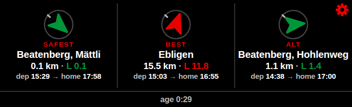
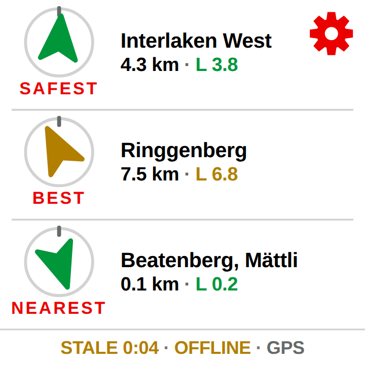

# XCTrack Get Home widget

A static web page, hosted on GitHub Pages, loaded in XCTrack's **Web page widget** (PRO).
While flying XC in Switzerland it shows **3 public-transport stops** the pilot could glide
to, chosen to get home as early as possible. Each option shows a north-up direction arrow,
distance, required glide ratio, the first usable departure, and the arrival time at the
configured home station.

Everything runs client-side: no backend, no API keys, no CDN at flight time.

## Repo layout

```
/
├─ web/                   # the widget (Vite, vanilla TypeScript, no framework)
│  ├─ index.html          # the widget page
│  ├─ setup.html          # config page: pick home, params → URL + QR
│  ├─ src/                # widget sources (main.ts, setup.ts, …)
│  ├─ public/data/        # stops.json.gz + meta.json (built by data/)
│  ├─ public/fixtures/    # IGC replay fixtures for development
│  └─ test/               # vitest unit tests
├─ data/                  # Python ETL (stops dataset, phase 2 travel-time tables)
├─ .github/workflows/
│  ├─ ci.yml              # typecheck + test on pushes and pull requests
│  └─ deploy.yml          # build web/ and deploy to GitHub Pages
└─ README.md
```

## Develop

```sh
cd web
npm install
npm run dev
```

`npm run dev` serves both pages: `/` is the widget, `/setup.html` the config page.
`npm run build` produces `web/dist/`, `npm run preview` serves that build.

## Test

```sh
cd web
npm test         # vitest
npm run typecheck  # tsc --noEmit
```

## Deploy

Pushing to `main` runs `.github/workflows/deploy.yml`, which builds `web/` and publishes
`web/dist` to GitHub Pages. The workflow sets `BASE_PATH=/<repo-name>/` so asset URLs are
correct on a project site; locally `BASE_PATH` defaults to `/`.

One-time setup: in the repository settings, under **Pages**, set the source to
**GitHub Actions**. The workflow can also be run manually via *workflow_dispatch*.

## How it works

**Reachability.** Every fix gives a position and an altitude. For each stop the widget
computes the usable height `h = alt − stopElevation − margin` (`margin` defaults to 150 m)
and the horizontal distance `d`. The required glide ratio is `Lreq = d / h`. Stops with
`h <= 50 m` or `Lreq > lmax` are dropped. A coarse lat/lon bounding box prefilters the
~30k stops before the haversine pass. There is no wind model and **no terrain check** —
the widget says so in its footer.

**Ground time.** Reaching a stop is not the same as catching a train. The widget adds
flying time `d / v` (trim speed, default 34 km/h), packing minutes and a landing-to-stop
walk, and rounds up to the next minute to get the earliest usable departure.

**Ranking.** For every reachable stop it estimates the arrival time at home:
`arrivalEst = earliestDep + travelEst`, where `travelEst` comes from the phase 2 offline
travel-time table when one is loaded, and otherwise from a heuristic (straight-line
distance at 50 km/h plus a wait allowance and a mode penalty). It then builds the Pareto
front over "lower required glide ratio" and "earlier arrival at home", and picks three:

1. **Safest** — among stops needing `Lreq <= lsafe`, the one arriving home earliest; if
   none qualify, simply the stop with the lowest `Lreq`.
2. **Best** — the earliest arrival on the front.
3. **Nearest** — the front's knee point: the one buying the most arrival-time improvement
   per unit of extra glide ratio over **Safest**, excluding the other two picks.

Picks that point in nearly the same direction and sit close together are rejected in
favour of the next point on the front, so the three options are genuinely different
choices. The picks plus a few near-front candidates are then routed live against
transport.opendata.ch; if live departures change the ordering, the pick-3 is rerun on the
routed data.

**Home-by mode.** Instead of "earliest", the pilot sets a land-by-home deadline. Each
candidate gets a time budget: minutes left before its latest connection that still makes
the deadline. Stops with a negative budget (already too late) drop out; BEST becomes the
stop with the most flying time left rather than the earliest arrival. The budget line
turns red under 15 minutes. If no stop can make the deadline, ranking falls back to
earliest mode silently and the widget shows that fallback happened.

**Location source.** As soon as XCTrack injects its `window.XCTrack` bridge, that bridge
is the only source of position: XCTrack may be fed by an external vario or by its own
track replay, so the phone's `navigator.geolocation` would report the wrong place or
nothing at all. Until the bridge returns a valid fix the widget shows
`waiting for XCTrack GPS`. Geolocation is used only outside XCTrack, and only when no
`replay` parameter is given. A fix is aged from the wall-clock moment it arrived, not
from the timestamp it carries, so a replay of a recorded flight is not immediately
"GPS lost". The timestamp it carries is the widget's clock instead: earliest departures,
the times sent to transport.opendata.ch, the home-by budget, the travel-time table's day
and hour bucket and the displayed data age are all computed in the time the source
reports, so a flight fed from an external vario or replayed from an IGC file is planned
in its own time rather than the phone's. Sources that report no time (geolocation, the
`?lat=&lng=` fallback) leave the widget on wall-clock time. Adding `?debug=1` to the widget URL draws a corner showing the active source,
the number of fixes received and the last raw payload.

**Arrow orientation.** Each pick's direction arrow is drawn either heading-up (rotated
against the aircraft's current track, from GPS speed/bearing or the compass heading when
too slow to trust GPS course) or north-up. This is a gear setting, not a URL parameter.

**Offline behaviour.** When the browser reports `navigator.onLine === false`, or the live
transport API has gone stale with no journeys fetched yet, the widget switches to
offline: it still ranks stops using the cached Phase 2 travel-time table (or the
heuristic if no table is loaded) but drops departure and arrival times from each cell
and shows an `OFFLINE` marker instead.

**Service worker.** `web/src/sw.ts` is built to `sw.js` at the site root and caches under
the name `xsbt-<app build id>-<dataset build id>`. The app build id is the git commit SHA
(`GITHUB_SHA` in CI), so every deploy produces a different `sw.js`, a different cache, and
an update the browser actually notices; the dataset build id is in the name too, so a
republished `stops.json` invalidates the cache on its own. Requests are routed by
`strategyFor` in `sw-route.ts`: navigations and `*.html` are network-first with the cached
copy as the offline fallback, hashed files under `assets/` and the `data/` JSON are
cache-first (a new cache per build makes them fresh after a deploy), `data/tables/*.bin[.gz]`
are cache-first out of a separate cache that survives deploys and is revalidated weekly, and
`sw.js` itself and cross-origin requests are not intercepted. When a new worker activates it
deletes the old caches, claims the open pages and posts `{type:"xsbt-updated"}` to them;
`main.ts` reloads once on that message (guarded by a `sessionStorage` flag) and calls
`registration.update()` on load and every six hours, so a widget XCTrack has kept open for a
whole flying day still picks up a deploy without anyone touching it.

**Limitations.**

- No wind model.
- No terrain check — reachability is a straight-line glide from the current fix to the
  stop's elevation, ignoring ridges and valleys in between.
- transport.opendata.ch is rate-limited to roughly 3 requests/second; a `429` response
  is handled with a 30-second backoff before the widget asks the API again.
- Altitude is always GPS altitude (`altGps`). Only when XCTrack reports none does the
  widget fall back to `stdBaroAlt`, which is the standard (QNE) pressure altitude
  referenced to 1013.25 hPa, not a true or QNH-corrected altitude.

## Setup in XCTrack

1. Open `setup.html` (the GitHub Pages URL, e.g. `https://<user>.github.io/<repo>/setup.html`)
   in a normal browser.
2. Search for the home station by name and pick it from the results; the search calls
   `transport.opendata.ch/v1/locations` directly.
3. Adjust parameters as needed: trim speed, packing/walking minutes, safety margin,
   max/safe glide ratio, theme, refresh interval, routed
   stop count, arrow orientation, and ranking mode (earliest, or home-by with a
   quarter-hour-stepped target time). Every field updates the URL preview live.
4. Copy the generated URL, or scan the QR code with the phone running XCTrack. "Test in
   browser" opens the widget with a bundled IGC flight replayed as the location source,
   for a sanity check before flying.
5. In XCTrack, add a **Web page widget** (PRO) to a flight page and paste the URL.
6. In flight, the widget is read-only until you long-press it — XCTrack's web widget
   only becomes interactive after a long press — after which the gear icon opens the
   in-widget settings overlay to change mode, home-by time and arrow orientation
   without leaving the flight page.

## Data

`data/` holds the two-phase Python ETL described in `data/README.md`:

- **Phase 1** (`build_stops.py`) builds `web/public/data/stops.json.gz` + `meta.json`:
  every Swiss public-transport stop plus foreign stops within 20 km of the border, with
  coordinates, elevation, and a mode bitmask. `verify_ids.py` confirmed the key finding
  that makes live routing possible: the DiDok/UIC `number` in the stop dataset is
  exactly the transport.opendata.ch station id, so the widget can route a stop with no
  separate id-mapping step.
- **Phase 2** (`build_homes.py` + `build_tables.py`) builds one binary table per home
  station under `web/public/data/tables/<homeId>.bin.gz`: the median travel time
  between the home and every stop, for 3 day types × 16 departure hours, computed with
  r5py over Swiss GTFS + OSM. `build_homes.py` produces `homes.txt`, the ~100 home
  stations to build tables for; any other station still works as a home in the widget,
  just without an offline table. The binaries are never committed — `.github/workflows/tables.yml`
  runs the build on a schedule and uploads them as the `tables` artifact, and
  `deploy.yml` downloads that artifact into `web/public/data/tables/` before building
  the site. With a table loaded the widget ranks stops from real travel times instead of
  the straight-line heuristic; see `data/README.md` for the binary format, sizing, and
  why the tables are routed home → stop and used in the other direction.

## Screenshots




More sizes and both themes are in `docs/screenshots/`. `docs/mockups/` holds the earlier
static design study (including an interactive `mockup.html`) that the in-widget visual
identity was validated against before implementation.
